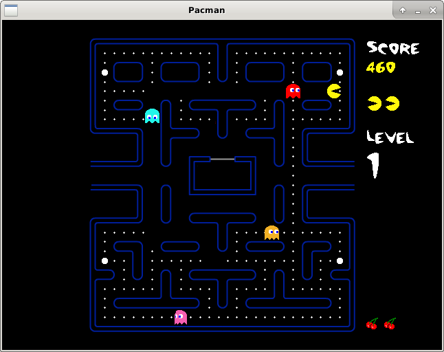

Pacman-ng
========================================================================



This is a clone of the original pacman by Namco, as I remember, that I played for the first time on an Atari 130 XL in the early 90s.

Also, Paul Neave's pacman clone has inspired me greatly.

One of the main goals of this implementation is an SDL application with a very low CPU usage.


## Building ##

Compilation can be done on most *nix OSes. For this, you'll need
* libsdl2
* sdl2-image
* sdl2-gfx
* sdl2-ttf
* sdl2-mixer

(make sure to also get the devel packages).  

On Debian/Ubuntu, this can be done like so:

```
sudo apt install libsdl2-2.0-0 libsdl2-dev libsdl2-image-2.0-0 libsdl2-image-dev libsdl2-gfx-1.0-0 \
                 libsdl2-gfx-dev libsdl2-ttf-2.0-0 libsdl2-ttf-dev libsdl2-mixer-2.0-0 libsdl2-mixer-dev
```

On Fedora/RedHat:

```
sudo dnf install make gcc-c++ SDL2 SDL2-devel SDL2_image SDL2_image-devel SDL2_mixer SDL2_mixer-devel SDL2_ttf SDL2_ttf-devel
```

Then, download and extract the zip file or clone the repository.
Inside the pacman-ng directory, run

```
./autogen.sh
./configure
make
make install
```

For more detailed instructions, you may also have a look at the [INSTALL](https://github.com/Alex313031/pacman-ng/blob/master/INSTALL) file.

After a successful installation, you should be able to start the game via the command line: `./pacman`

## License ##
Pacman-ng is licensed under the terms of the GNU General Public License version 3 (or any later version).
